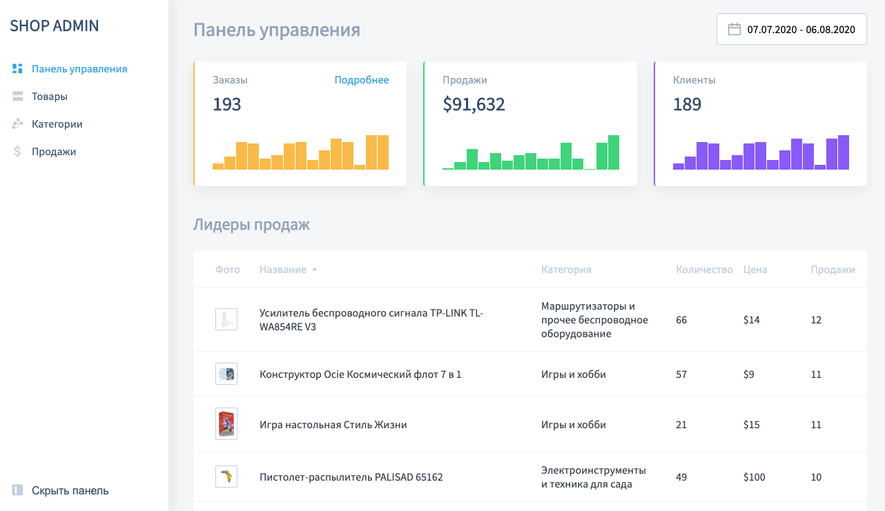

# Admin Dashboard

**Important!**

For correct build via Webpack you must have:

* nodejs >=16.13.1
* npm >= 7.10.0

Данный проект был разработан в рамках курса ["JavaScript/​DOM/​Интерфейсы" для программистов](https://learn.javascript.ru/courses/js)
проекта [learn.javascript.ru](https://learn.javascript.ru/)

> Этот курс предназначен для изучения JavaScript программистами, а также для тех, кто разрабатывал на нём эпизодически и теперь хочет освоить профессионально.

Проект - это фронтенд часть типичной "Панели управления" для магазина товаров,
реализованная на чистом JavaScript.

## Preview

## Tech stack

*  Javascript
*  HTML
*  CSS

## To start project in development mode:

* `npm install` - установит необходимые зависимости
* `npm run develop` - запустит "WebpackDevServer"

**Note:** Версии требуемые проектом указаны в `package.json` в поле `engines`

## To build project:

`npm run build` - "соберет" проект в "production" режиме.

## Teacher

**Владимир Шевчук**

* [ GitHub](https://github.com/dosandk)
* [ learn.javascript](http://learn.javascript.ru/profile/v-shevchuk)
* [ Linkedin](https://www.linkedin.com/in/dosandk/)
